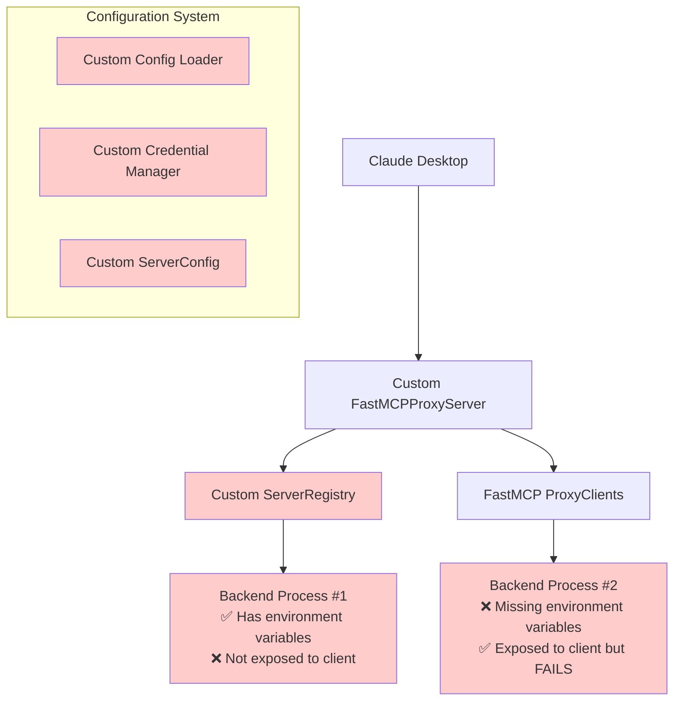
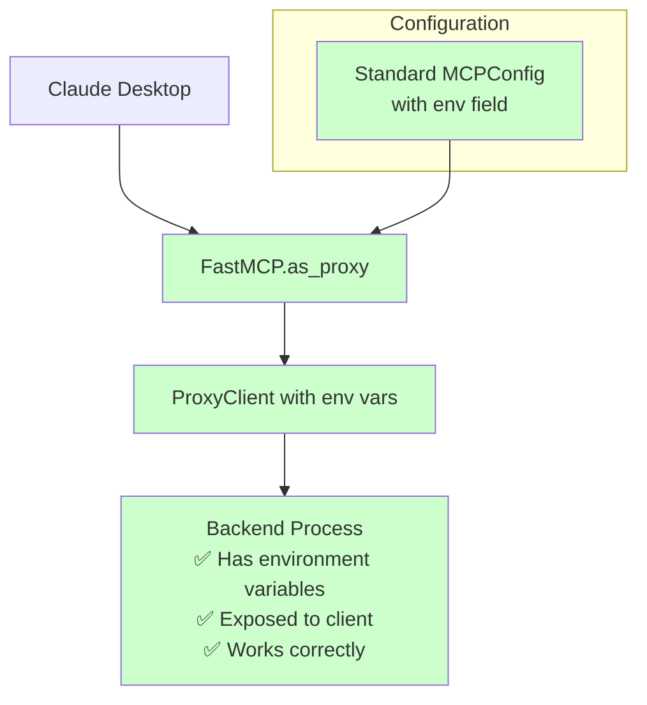

# FastMCP Proxy Server Architecture Rework Plan

## Executive Summary

This document outlines a comprehensive refactor to fix the dual execution path problem and align with FastMCP's recommended patterns. The plan simplifies the architecture by removing custom components and using FastMCP's standard `ProxyClient` with proper environment variable handling.

## Current vs. Proposed Architecture

### Current Architecture (Broken)


### Proposed Architecture (FastMCP Compliant)


## Detailed Changes Plan

### Phase 1: Remove Broken Architecture Components

#### Files to DELETE entirely:
1. **`src/mcp_proxy_server/server_registry.py`** - Root cause of dual execution paths
2. **`src/mcp_proxy_server/credentials.py`** - Complex credential discovery system
3. **`src/mcp_proxy_server/config.py`** - Custom configuration classes
4. **`src/mcp_proxy_server/proxy/server.py`** - Custom proxy implementation
5. **`src/mcp_proxy_server/session/`** directory - Custom session management (if exists)
6. **`src/mcp_proxy_server/middleware/`** directory - Custom middleware (if exists)
7. **`tests/`** directory - All existing tests

#### Why delete these?
- ServerRegistry creates the duplicate process problem
- Custom config system adds unnecessary complexity
- Custom proxy implementation doesn't leverage FastMCP properly
- Tests are built around the broken architecture

### Phase 2: Implement FastMCP-Compliant Architecture

#### Files to CREATE:

1. **`src/mcp_proxy_server/proxy.py`** - New simplified proxy implementation:
```python
from fastmcp import FastMCP
from fastmcp.server.proxy import ProxyClient

def create_proxy_from_config(config: dict) -> FastMCP:
    """Create FastMCP proxy from MCPConfig format."""
    return FastMCP.as_proxy(config, name="MCP-Proxy")

def create_single_server_proxy(server_config: dict) -> FastMCP:
    """Create proxy for single server with proper env handling."""
    proxy_client = ProxyClient(
        command=server_config["command"],
        args=server_config.get("args", []),
        env=server_config.get("env", {})  # ← FIX: Pass environment variables
    )
    return FastMCP.as_proxy(proxy_client, name="MCP-Proxy")
```

2. **`src/mcp_proxy_server/config_handler.py`** - MCPConfig format handler:
```python
from typing import Dict, Any

def load_mcp_config(config_path: str) -> Dict[str, Any]:
    """Load and validate MCPConfig format."""
    # Simple JSON loading with MCPConfig validation

def expand_env_vars_in_config(config: Dict[str, Any]) -> Dict[str, Any]:
    """Expand ${VAR_NAME} in config using FastMCP patterns."""
    # Simplified environment variable expansion
```

#### Files to MODIFY:

1. **`src/mcp_proxy_server/cli.py`** - Simplify CLI:
```python
# Remove complex config validation
# Support only MCPConfig format
# Focus on uv deployment initially
# Remove create-config command complexity

@click.command()
@click.option('--config', required=True, help='MCPConfig JSON file')
def run(config: str):
    """Run proxy server with MCPConfig."""
    config_data = load_mcp_config(config)
    proxy = create_proxy_from_config(config_data)
    proxy.run()  # Uses stdio by default for Claude Desktop
```

2. **`src/mcp_proxy_server/__main__.py`** - Update entry point:
```python
# Simplified entry point using new proxy implementation
```

3. **`pyproject.toml`** - Update dependencies:
```toml
# Remove test-related dependencies for now
# Ensure FastMCP is properly specified
# Update console scripts to use new implementation
```

### Phase 3: New Configuration Format

#### Current Complex Format → Standard MCPConfig

**BEFORE (Complex Custom Format):**
```json
{
  "host": "localhost",
  "port": 8080,
  "transport": "stdio",
  "servers": [
    {
      "name": "server-name",
      "transport": "stdio",
      "command": ["command", "args"],
      "enabled": true,
      "timeout": 30,
      "namespace": "optional-namespace",
      "env": {
        "API_KEY": "${ENV_VAR_NAME}"
      }
    }
  ]
}
```

**AFTER (Standard MCPConfig):**
```json
{
  "mcpServers": {
    "server-name": {
      "command": "command",
      "args": ["args"],
      "transport": "stdio",
      "env": {
        "API_KEY": "actual-value-or-env-var"
      }
    }
  }
}
```

### Phase 4: Rewrite Tests Around FastMCP Patterns

#### New Test Structure:
```
tests/
├── test_proxy_creation.py       # Test FastMCP.as_proxy() usage
├── test_config_handling.py      # Test MCPConfig format
├── test_environment_vars.py     # Test env var passing
├── test_session_isolation.py    # Test ProxyClient session handling
├── test_cli.py                  # Test simplified CLI
└── fixtures/
    ├── example_config.json      # MCPConfig examples
    └── mock_servers/            # Simple test servers
```

#### Test Examples:
```python
# test_environment_vars.py
def test_env_vars_passed_to_backend():
    """Verify environment variables reach backend process."""
    config = {
        "mcpServers": {
            "test-server": {
                "command": "python",
                "args": ["test_server.py"],
                "env": {"TEST_VAR": "test_value"}
            }
        }
    }
    proxy = create_proxy_from_config(config)
    # Test that backend receives TEST_VAR
```

## Implementation Timeline

### Phase 1: Delete Broken Components (Day 1)
- [ ] Delete ServerRegistry and related files
- [ ] Delete custom config system
- [ ] Delete all existing tests
- [ ] Commit: "Remove dual execution path architecture"

### Phase 2: Implement FastMCP-Compliant Core (Day 1-2)
- [ ] Create new proxy.py with FastMCP.as_proxy()
- [ ] Create config_handler.py for MCPConfig
- [ ] Update CLI to use new implementation
- [ ] Commit: "Implement FastMCP-compliant proxy architecture"

### Phase 3: New Tests (Day 2-3)
- [ ] Write tests around FastMCP patterns
- [ ] Test environment variable passing
- [ ] Test session isolation
- [ ] Commit: "Add tests for new FastMCP architecture"

### Phase 4: Documentation and Examples (Day 3)
- [ ] Update CLAUDE.md with new architecture
- [ ] Create example MCPConfig files
- [ ] Update README with migration guide
- [ ] Commit: "Update documentation for new architecture"

## File Structure After Refactor

```
src/mcp_proxy_server/
├── __init__.py
├── __main__.py              # Simplified entry point
├── cli.py                   # Simplified CLI (MCPConfig only)
├── proxy.py                 # NEW: FastMCP.as_proxy() implementation
└── config_handler.py        # NEW: MCPConfig format handling

tests/                       # NEW: Tests around FastMCP patterns
├── test_proxy_creation.py
├── test_config_handling.py
├── test_environment_vars.py
├── test_session_isolation.py
├── test_cli.py
└── fixtures/
    ├── example_config.json
    └── mock_servers/

examples/                    # NEW: MCPConfig examples
├── simple_proxy.json
├── multi_server_proxy.json
└── obsidian_example.json

# DELETED FILES (solving dual execution problem):
# src/mcp_proxy_server/server_registry.py
# src/mcp_proxy_server/credentials.py
# src/mcp_proxy_server/config.py
# src/mcp_proxy_server/proxy/server.py
# src/mcp_proxy_server/session/
# src/mcp_proxy_server/middleware/
# tests/ (old test structure)
```

## Key Benefits of This Refactor

1. **Fixes Dual Execution Path**: Only one backend process per server, with proper environment variables
2. **FastMCP Compliance**: Uses recommended patterns from FastMCP documentation
3. **Simplified Configuration**: Standard MCPConfig format, easier to understand and debug
4. **Reduced Complexity**: ~50% less code, easier to maintain
5. **Better Environment Handling**: Direct environment variable passing via MCPConfig
6. **Session Isolation**: Proper session handling per FastMCP recommendations

## Risk Mitigation

1. **Breaking Changes**: This is a major refactor, existing configs will need migration
2. **Testing**: New test suite will be smaller initially but more focused
3. **Deployment**: Initially focus on uv deployment, add others later
4. **Migration Path**: Will need documentation for users to migrate configs

## Next Steps for Approval

Please review this plan and confirm:
1. Are you comfortable with deleting the entire existing test suite?
2. Are you okay with breaking changes to the configuration format?
3. Should I proceed with this phased approach?
4. Any specific concerns about the FastMCP.as_proxy() approach?

This refactor will solve the core architectural problems while aligning with FastMCP best practices.